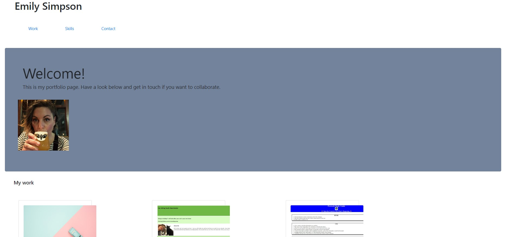

# Challenge 3

For this challenge we were asked to create a portfolio website with Bootstrap components such as a jumbotron and cards. I created mine from scratch rather than update from the previous assignment, since I had gone slightly 'off-piste' and built a cat sitting website instead of a portfolio. 

Below I've listed the acceptance criteria we were given. 

# Acceptance criteria

Using Bootstrap, recreate your portfolio site with the following items:

A navigation bar

A navigation menu at the top. Feel free to use Bootstrap's navbar or create your own.

Include links that are applicable to your portfolio.

Links should navigate to the appropriate sections

A hero section

A jumbotron featuring your picture, your name, and any other information you'd like to include.
A work section

A section displaying your work in grid.

If you need to use placeholder image use placehold.coLinks to an external site.

Use Bootstrap cards for each project.

The description should give a brief overview of the work.

Each project will eventually link to your class project work!

A skills section

List out the skills you expect to learn from the bootcamp.
An about/contact section

An About Me section in the same row.
A footer section

All hyperlinks should have a hover effect.

All buttons should display a box shadow upon hover.

Your Bootstrap solution should minimize use of media queries.

Deploy your new Bootstrap-powered portfolio to GitHub Pages.

